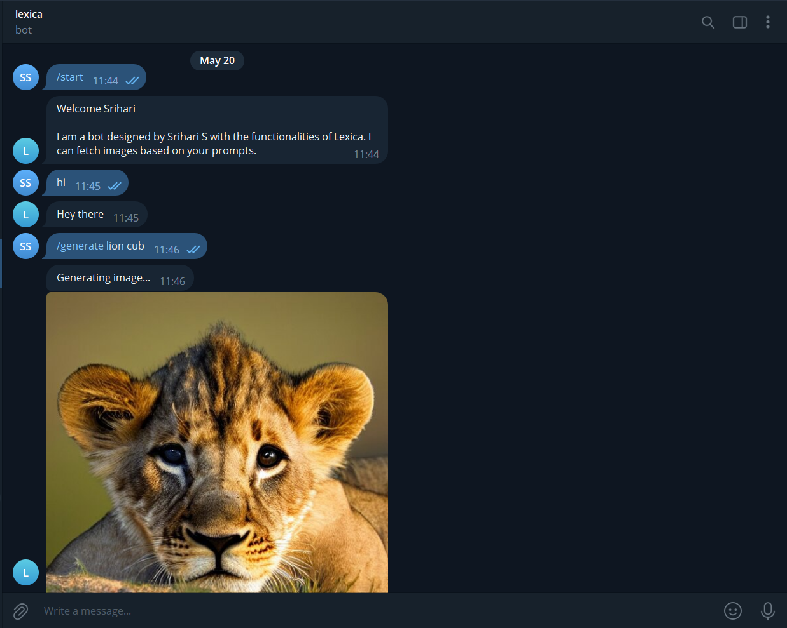

# Lexica-Bot

## Description
Lexica-Bot is a Telegram bot that can be used to generate a single or multiple images based on the user prompts.
This bot is written in Javascript and uses the [Telegraf](https://telegraf.js.org) framework.

## Screenshot
